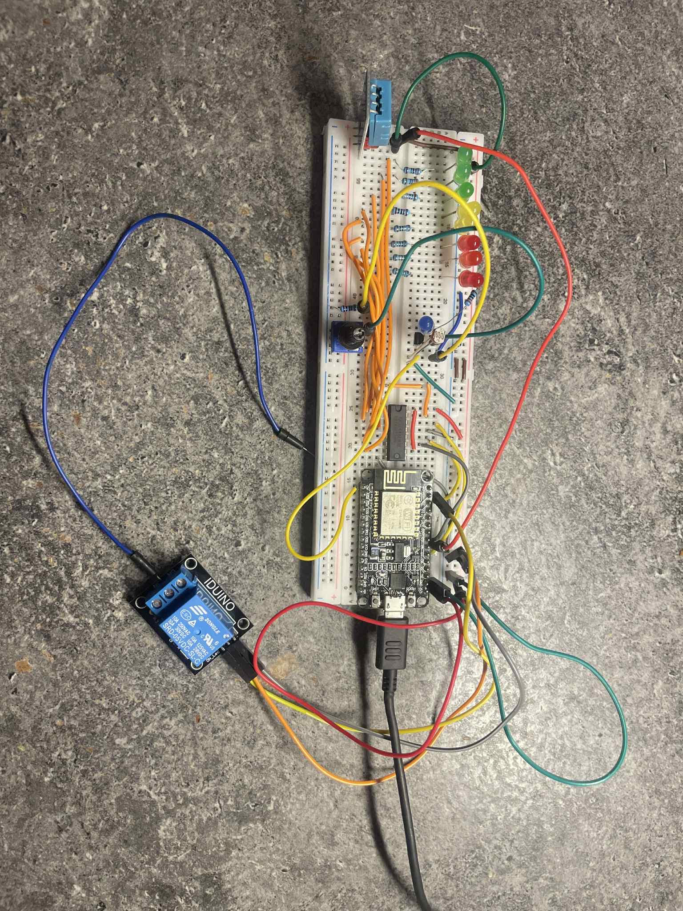

# Reaction Time Game (Arduino)

**Author:** Goda Gutparakyte  
**Course:** Introduction to Robotics at Vilnius University  
**Assignment:** HW3
**Last Updated:** 2025-11-04  

---

## Overview
This project implements a mock version of **server rack monitor** using ESP8266-WiFi microcontrller. 
Logic:
- DHT11 sensor evaluates humidity and temperature
- Photoresistor detects light changes
- 8-bit shift register is used to control 8 LEDs:
    - If the temperature and humidity are in safe zone, 3 green LEDs light on
    - If it is in the warning zone - 2 yellow LEDs
    - If its above the thresholds - 3 red LEDs and relay turns on a motor fan to decrease the temperature
- Along with the photoresistor, there is an NPN transisotr, which allows to regulate the current with the help of potentionmeter
- If the photoresistor indicates light, all LEDs start blinking --> indicating that someone is in the room (light  on)
- All of the sensors can be monitored on a local IP provided by the router
---

## Picture of the circuit

---

## Build Steps
1. Connect all components according to the wiring table provided below
2. Open the `.ino` file in Arduino IDE  
3. Select Board: Arduino Uno 
4. Select the correct COM port  
5. Click Upload  
---

---
## Component list
| Name | Quantity | Component |
|------|-----------|------------|
| U1 | 1 | ESP8266 |
| L1 - L9 | 9 | LEDs |
| R1 - R6| 6 | 1 kΩ Resistor |
| R7 - R8 | 2 | 20 kΩ Resistor |
| R9 - R10 | 2 | 220 Ω Resistor |
| R11 | 1 | 10 Ω Resistor |
| F1 | 1 | Motor fan |
| T1 | 1 | NPN transistor |
| RE | 1 | Relay module |
| F | 1 | Motor fan |
| H | 1 | DHT11 Humidity and Temp sensor |
| P | 1 | Photoresistor |
| S | 1 | 8-bit shift register |
| Po | 1 | Potentiometer |
##  Wiring

 

